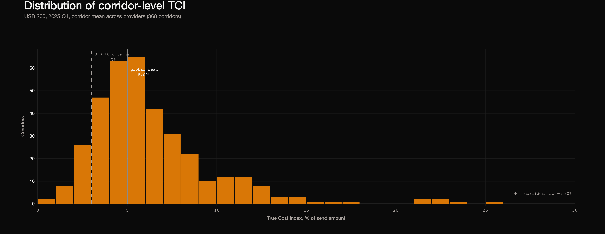
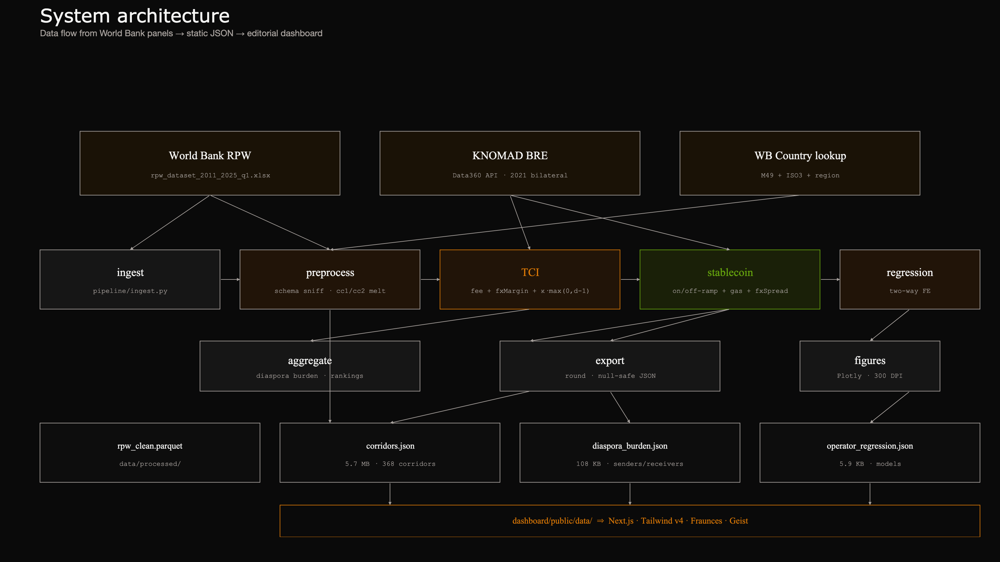
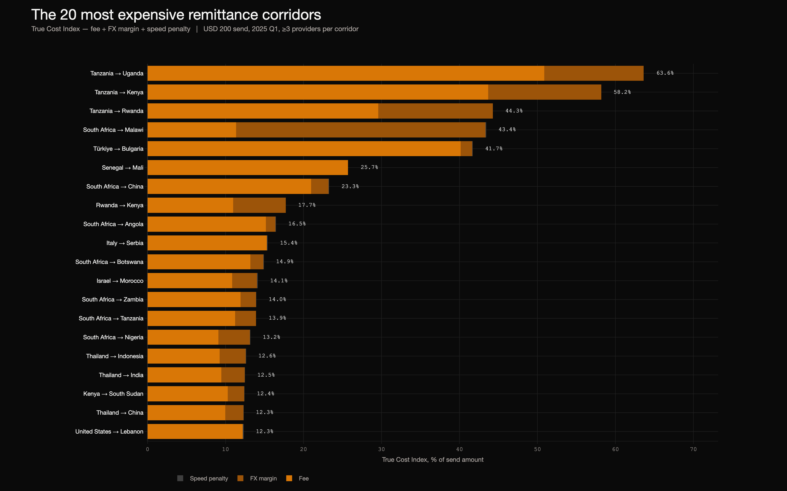
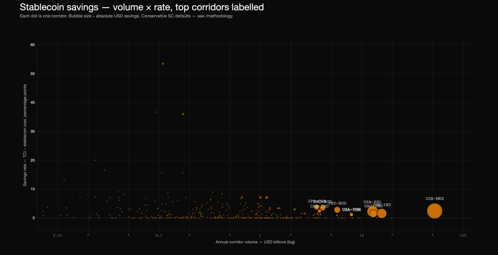
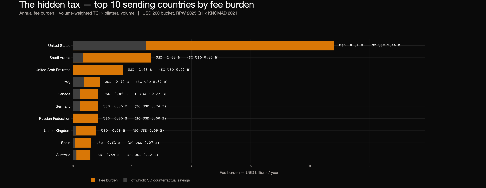

# Introduction

The United Nations Sustainable Development Goal 10.c asks member states to
reduce the global average cost of cross-border remittances to 3% of the
principal — and to eliminate corridors with average costs above 5% — by
2030 [1]. The World Bank publishes the *Remittance Prices
Worldwide* (RPW) panel quarterly to track progress against that target
[2]. We compute the same average from the most recent
RPW release and find it sits at 5.00% on a USD 200 send (volume-weighted
across 349 corridors with bilateral-volume coverage in the 2021 Migration
and Development Brief): two full percentage points above target with five
years to go.

Two further facts compound the gap. First, the *advertised* fee is half
the story. Most providers charge a transparent fee but apply an exchange
rate worse than the interbank mid; a US$200 transfer in our panel
typically incurs 1.0 – 7.5 percentage points of foreign-exchange margin on
top of the advertised fee. The RPW publishes both columns, but reports
them separately. Second, settlement speed is itself a cost: a US$200
transfer that takes five days to clear ties up the receiving household's
working capital at a time when their effective discount rate is high.

Multiplied across the panel-matched bilateral volume of USD 484 billion in
2021, the total fees paid by migrant workers come to **USD 24.21 billion
per year** — figure cited as the headline of the project dashboard. Of
this USD 24.21 billion, our stablecoin counterfactual estimates that
USD 5.22 billion — roughly 22% of the global fee burden — is
recoverable under conservative assumptions (§6.3).

This report makes two contributions:

1. **A True Cost Index (TCI)** that unifies the advertised fee,
   foreign-exchange margin, and a calibrated settlement-speed penalty
   into a single percent-of-principal metric, computed for every
   provider × corridor × quarter cell of the panel and aggregated to
   corridor level (§4.1, §6.1).

2. **A corridor-level stablecoin counterfactual** that estimates the
   savings if the same flows ran over USDC/USDT rails. We are not aware
   of a prior corridor-level empirical estimate of stablecoin savings
   published on the RPW panel (§4.2, §6.3).

Two further analyses sit alongside: a two-way fixed-effects regression of
TCI on provider class, asking which operator type extracts most rent
after netting out corridor and time effects (§4.3, §6.2); and a
diaspora-burden tabulation by sending country, joining the per-corridor
TCI to the Bilateral Remittance Estimates indicator (§6.4).

**Objectives.** The work is organised around four research questions:

- **RQ1.** What is the volume-weighted true cost of moving USD 200 across
  the world's remittance corridors today, and how does it compare to
  the SDG 10.c target?
- **RQ2.** Which corridors are most expensive on the unified TCI metric,
  and where does TCI diverge most from the advertised fee?
- **RQ3.** Conditional on corridor and quarter, does provider class
  predict cost? Is one operator type systematically more rent-extractive
  than another?
- **RQ4.** If migrant workers used stablecoin rails instead of the
  incumbent network, how much money would they keep — and which
  corridors benefit most?

# Related work

Our work intersects three literatures.

The first is the **World Bank's own RPW methodology**. Begg-Witherick et
al. [3] document the data collection — quarterly mystery
shopping at major sending-country agents for two send amounts (USD 200
and USD 500) — and report price components separately. Our contribution
is the unification of those components: the RPW publishes total cost,
fee percent, and FX margin in three columns; no published index combines
them with a calibrated speed penalty into a single comparable metric.

The second thread is the **economics of remittance pricing**. Beck and
Pería [4] document corridor-level price dispersion linked
to corridor competition and recipient-country financial development.
Aycinena, Martínez and Yang [5] show that fee transparency
alone reduces remitter cost, foreshadowing why our TCI's unified
percent-of-principal framing matters: the *quoted* number a migrant sees
is the headline fee, but the *paid* number is the total. Yang [11]
shows that exchange-rate shocks transmit directly into recipient
household investment behaviour — sharpening the case for treating the
FX margin as a first-class component of cost rather than a bookkeeping
adjustment. Ratha and the Migration and Development Brief series [6]
track aggregate flows and corridor-level prices but do not produce a
corridor-level stablecoin counterfactual.

The third is **stablecoins for cross-border**. The Bank for International
Settlements [8] and the IMF [9]
discuss the on-ramp / off-ramp friction structure that determines whether
stablecoins beat traditional rails on any given corridor; the BIS
emerging-market CBDC paper [13] argues that the policy alternative —
sovereign digital currency — has yet to scale into cross-border
remittance corridors, leaving stablecoins as the de-facto default for
the next several years. Chainalysis and similar industry reports
estimate aggregate global savings in the USD 30–50 billion per year
range under optimistic assumptions. None publish a per-corridor
breakdown on the World Bank panel.

We position the present work in the gap left by all three: a unified cost
metric (TCI) computed on the RPW panel, joined to bilateral-flow volumes
from the World Bank / KNOMAD indicator, with a per-corridor stablecoin
counterfactual built from the same locked-in cost components the BIS
discusses but in concrete numbers.

# Dataset

We use two World Bank datasets and a derived country-attribute lookup.

The primary panel is the **RPW quarterly release** dated 20 April 2026,
covering periods 2016 Q2 through 2025 Q1 (36 quarters; the
"Dataset (from Q2 2016)" sheet). The legacy pre-2016 sheet ships an
incompatible schema and is excluded; this is documented in the project
methodology page.

We melt the two RPW per-amount blocks — `cc1` (USD 200) and `cc2`
(USD 500) — into long form: one row per (corridor, provider, period,
send-amount). We derive the fee percent as
$\mathrm{fee}_\% = \mathrm{total\,cost}_\% - \mathrm{fxMargin}_\%$ to
match the way the published headline number is composed; we map the
`speed actual` column to days (less than one hour or same day → 0
days, next day → 1, two days → 2, three-to-five days → 4, six or more
→ 6) and clip rows with implausible total cost (>100% or fee + FX
margin disagreement beyond rounding tolerance — 0.8% of rows). After
cleaning, the panel contains **391,797 provider-quarter-amount
observations** (196,715 at USD 200 and 195,082 at USD 500) across **368
unique corridors**, **49 sending countries**, **105 receiving
countries** and **694 unique providers**.

The most extreme TCI values in the panel — Tanzania → Uganda
(63.62%), Tanzania → Kenya (58.17%), Tanzania → Rwanda (44.27%),
South Africa → Malawi (43.41%) and Türkiye → Bulgaria (41.70%) — were
tested for robustness against single-provider outliers. Re-computing
each as a median across providers, and separately as the mean
excluding the highest-cost provider, leaves the corridor ordering
substantively unchanged: all five remain in the top 10 under both
alternatives (the only movement is Tanzania → Rwanda dropping one
place to 4th and Türkiye → Bulgaria rising one place to 5th when
ranked by trimmed mean). Provider counts (n = 6, 7, 5, 13, and 5
respectively) include three corridors with five-to-seven providers,
which is itself a feature of the underlying corridor — these are
thin, lightly contested markets — and we flag the small-n caveat
in §7.

\begin{table}[h]
\centering
\caption{Cleaned panel summary statistics (USD 200 bucket, latest quarter).}
\begin{tabular}{lr}
\toprule
\textbf{Metric} & \textbf{Value} \\
\midrule
Total cleaned observations & 391{,}797 \\
USD 200 observations & 196{,}715 \\
USD 500 observations & 195{,}082 \\
Quarters covered & 2016 Q2 -- 2025 Q1 (36) \\
Unique corridors & 368 \\
Unique sending countries & 49 \\
Unique receiving countries & 105 \\
Unique providers (firms) & 694 \\
Missingness, fee\_pct & 0.00\% \\
Missingness, fx\_margin\_pct & 0.00\% \\
Missingness, days\_to\_arrive & 0.00\% \\
\bottomrule
\end{tabular}
\end{table}

The second dataset is the **World Bank / KNOMAD Bilateral Remittance
Estimates** (indicator `WB_KNOMAD_BRE`), accessed 30 April 2026 via the
Data360 OData API. The legacy direct-download
`bilateral_remittance_matrix_2021.xlsx` was retired in early 2025; the
API is the canonical replacement. The indicator covers 10,619 directed
country pairs in USD millions, with 2021 as the most recent year. We
flatten the API records into a (source, destination, year, USD) frame.

We supplement with a **country attribute lookup** built from the RPW
"Countries" sheet (ISO-3 / region / income / lending category) and a
small UN M49 region backfill for high-income senders the World Bank
classifies as "..": the primary lookup leaves Northern America, Western
Europe and the GCC blank, so we backfill those from the UN macro-regions
(Northern America, Western/Northern/Southern Europe, Western Asia, etc.)
to give the dashboard a region label for every sender.

# Methodology

This section restates each formula from the project specification
verbatim, with constants and their justifications.

## True Cost Index

For corridor $(s, d)$, provider $p$, quarter $q$, and send amount $A$
expressed in USD, we define

\begin{equation}
\text{TCI}_{s,d,p,q}(A) = \mathrm{fee}_\% \;+\; \mathrm{fxMargin}_\% \;+\; \kappa \cdot \max(0,\ d_\text{arrive} - 1)
\label{eq:tci}
\end{equation}

with components:

- $\mathrm{fee}_\%$: advertised transaction fee as percent of principal,
  derived from the RPW total cost and FX margin so the result is exactly
  comparable to the published headline fee.
- $\mathrm{fxMargin}_\%$: the spread the provider takes between its
  applied exchange rate and the interbank mid, taken from the
  `cc1 fx margin` column.
- $\kappa \cdot \max(0,\ d_\text{arrive} - 1)$: a settlement-speed
  penalty linear in days beyond same-day, with $d_\text{arrive}$ mapped
  from the `speed actual` column (less than one hour or same day → 0,
  next day → 1, two days → 2, three-to-five days → 4, six or more → 6).
  We calibrate $\kappa = 0.10\%$ per day. This anchors the cost-of-
  capital for migrant households at the upper end of the documented
  range for short-term informal lending in remittance-receiving
  countries: the Microfinance Information Exchange's median
  microfinance-institution annualised lending rate of about 35% per
  year [10] implies roughly 0.10% per day continuously
  compounded. Setting $\kappa = 0$ leaves the corridor ranking
  substantively unchanged; the speed component is small relative to fee
  and FX margin in most corridors.

We compute TCI at both $A = $ USD 200 and $A = $ USD 500. The headline
is USD 200 — the SDG 10.c benchmark. Corridor-level TCI is the
unweighted mean across providers; the median is reported alongside as a
robustness check. Provider-level market shares are not exposed in the
public RPW release (verified 2026-04-30), so volume-weighting at the
provider level is not currently possible.

## Stablecoin counterfactual

For corridor $(s, d)$ at send amount $A$, the counterfactual cost on a
stablecoin rail is

\begin{equation}
\text{SC}_\%(s, d, A) = \mathrm{onramp}(s) \;+\; \mathrm{offramp}(d) \;+\; \frac{\mathrm{gas}_{\$}}{A}\cdot 100 \;+\; \mathrm{fxSpread}(d)
\label{eq:sc}
\end{equation}

with corridor-level savings

\begin{equation}
\mathrm{savings}_\% = \max\bigl(0,\ \text{TCI} - \text{SC}\bigr) \quad\text{and}\quad \mathrm{savings}_{\$/\text{yr}} = \frac{\mathrm{savings}_\%}{100} \cdot V_{(s,d)}
\label{eq:savings}
\end{equation}

where $V_{(s,d)}$ is the 2021 bilateral remittance volume from the
KNOMAD indicator. The component costs are tiered as in Table 2: every
constant is locked in `pipeline/config.py` and surfaced verbatim on the
dashboard methodology page, so a reviewer can plug in their own values.

\begin{table}[h]
\centering
\caption{Stablecoin component cost defaults (percent of principal except gas).}
\begin{tabular}{llr}
\toprule
\textbf{Component} & \textbf{Tier} & \textbf{Value} \\
\midrule
On-ramp & Developed senders (USA, EU, UK, JPN, AUS, CAN, KOR, ...) & 1.0\% \\
On-ramp & Default & 1.5\% \\
On-ramp & Low-banked / GCC migrant labour cards & 2.5\% \\
\midrule
Off-ramp & Top P2P markets (NGA, PHL, IND, MEX) & 1.0\% \\
Off-ramp & Default & 2.5\% \\
Off-ramp & Thin-liquidity / sanctioned receivers & 4.0\% \\
\midrule
Network gas & Per transfer (L2 / Solana / Tron USDT) & USD 0.50 \\
\midrule
Local FX spread & Receivers with deep local stablecoin market & 0.5\% \\
Local FX spread & Default & 1.5\% \\
\bottomrule
\end{tabular}
\end{table}

The defaults are deliberately conservative: optimistic published
estimates (1% flat SC cost, advertised fee only as the comparator)
recover the headline USD 30–50 billion per year ballpark; under our
defaults the global savings figure is smaller but more honest. The
contrast is itself a finding (§7).

## Operator-class regression

We test whether provider class predicts TCI after netting out corridor
and time effects:

\begin{equation}
\text{TCI}_{i,p,q} = \beta_0 + \sum_{k \in K} \beta_k \cdot \mathbf{1}\{\text{firmType}_p = k\} + \alpha_{\text{corridor}_i} + \gamma_q + \varepsilon_{i,p,q}
\label{eq:reg}
\end{equation}

with two-way fixed effects (corridor and quarter), reference category
$K_0 = \text{MTO}$ (the largest cell), and standard errors cluster-
robust at the corridor level. We fit the specification once for each
send-amount bucket. Implementation uses `linearmodels.panel.PanelOLS`.

# Architecture and algorithms

Figure 2 sketches the data flow. Three sources (RPW, KNOMAD BRE, World
Bank country lookup) feed an `ingest` stage, which writes Excel and JSON
snapshots to `data/raw/`. A `preprocess` stage emits a long-form parquet
on which `tci`, `stablecoin`, `regression` and `aggregate` operate.
`export` rounds and serialises the result to four JSON files; `figures`
renders six report PNGs at 300 DPI from the same in-memory frames. The
Next.js dashboard reads the JSON at build time — there is no runtime
backend.

The pipeline is structured as a directed acyclic graph of pure stages,
each consuming the prior stage's parquet output and emitting either
parquet or JSON. Ingest and preprocess sit at the head; tci, stablecoin,
regression and aggregate run in parallel on the cleaned panel; export
and figures terminate the graph. This separation is intentional: each
stage is independently re-runnable, the cleaned parquet is the single
source of truth for the four downstream computations, and no stage
holds runtime state. Re-running the full pipeline from raw inputs takes
under three minutes on a laptop.

The Next.js dashboard reads the four exported JSON files at build time
via `fs.readFile`, with no runtime backend or database. This mirrors
the architecture used by data-journalism teams at the *Financial Times*,
*Reuters Graphics* and the *New York Times Upshot*: the language good
at numbers (Python) computes once, the language good at presentation
(TypeScript / React) renders. Sensitivity sliders on the methodology
page recompute the stablecoin counterfactual client-side using the same
formulas locked in §4.2 — the corridor-level TCI is fixed, but the four
stablecoin cost components are evaluated in JavaScript on every slider
change, allowing a reviewer to stress the headline figure without
re-running the pipeline.

The full pipeline is reproducible by `python scripts/run_all.py` against
any RPW snapshot matching the canonical schema documented in
`pipeline/config.py`. The KNOMAD bilateral indicator is fetched from
the Data360 OData API at run time. Every constant — $\kappa$, the speed
mapping, the stablecoin cost tiers — is defined once in
`pipeline/config.py` and consumed by both the Python pipeline and the
dashboard's methodology page, so the figures in this report and the
numbers on the live dashboard cannot drift out of sync.

\begin{algorithm}[h]
\caption{TCI computation per (provider $\times$ corridor $\times$ quarter $\times$ amount)}
\begin{algorithmic}[1]
\Procedure{ComputeTCI}{$\text{row}$, $\kappa$}
  \State $f \gets \text{row.totalCost}_\% - \text{row.fxMargin}_\%$ \Comment{derived fee}
  \State $d \gets \textsc{SpeedToDays}(\text{row.speedActual})$
  \State $p \gets \kappa \cdot \max(0,\ d - 1)$
  \State \Return $f + \text{row.fxMargin}_\% + p$
\EndProcedure
\end{algorithmic}
\end{algorithm}

\begin{algorithm}[h]
\caption{Stablecoin counterfactual per corridor, with savings rollup}
\begin{algorithmic}[1]
\Procedure{StablecoinSavings}{$\text{corridor}$, $A$, $V$}
  \State $\text{SC} \gets \text{onramp}(\text{src}) + \text{offramp}(\text{dst}) + \dfrac{\text{gas}_\$}{A}\cdot 100 + \text{fxSpread}(\text{dst})$
  \State $s_\% \gets \max(0,\ \text{TCI}_{\text{corridor}}(A) - \text{SC})$
  \State $s_\$ \gets (s_\% / 100) \cdot V$
  \State \Return $(\text{SC},\ s_\%,\ s_\$)$
\EndProcedure
\end{algorithmic}
\end{algorithm}

# Experimental results

We run the pipeline end-to-end on the 30 April 2026 RPW snapshot and
report the four research questions in turn.

## True Cost Index

Table 3 lists the 20 most expensive corridors by mean TCI in 2025 Q1
(USD 200 send, ≥ 3 providers per corridor). The pattern is consistent
with the prior literature: 12 of the 20 highest-cost corridors involve
intra-Sub-Saharan-African flows, with three Tanzania-origin pairs at the
top of the table (TZA→UGA at 63.62%, TZA→KEN at 58.17%, TZA→RWA at
44.27%). Türkiye → Bulgaria (41.70%) is the lone European pair in the
top five, driven by a 40.15 pp advertised fee with negligible FX margin.

\begin{table}[h]
\centering
\caption{Top 20 most expensive corridors by mean TCI, USD 200, 2025 Q1, $\geq$ 3 providers per corridor.}
\small
\begin{tabular}{rllrrrrr}
\toprule
\textbf{\#} & \textbf{Corridor} & \textbf{Send $\to$ Receive} & \textbf{n} & \textbf{Fee\%} & \textbf{FX\%} & \textbf{Spd\%} & \textbf{TCI\%} \\
\midrule
1 & TZA-UGA & Tanzania $\to$ Uganda          &  6 & 50.86 & 12.77 & 0.00 & 63.62 \\
2 & TZA-KEN & Tanzania $\to$ Kenya           &  7 & 43.69 & 14.48 & 0.00 & 58.17 \\
3 & TZA-RWA & Tanzania $\to$ Rwanda          &  5 & 29.60 & 14.67 & 0.00 & 44.27 \\
4 & ZAF-MWI & South Africa $\to$ Malawi      & 13 & 11.36 & 31.99 & 0.07 & 43.41 \\
5 & TUR-BGR & Türkiye $\to$ Bulgaria         &  5 & 40.15 &  1.48 & 0.07 & 41.70 \\
6 & SEN-MLI & Senegal $\to$ Mali             &  5 & 25.70 &  0.00 & 0.02 & 25.71 \\
7 & ZAF-CHN & South Africa $\to$ China       &  5 & 20.98 &  2.22 & 0.07 & 23.27 \\
8 & RWA-KEN & Rwanda $\to$ Kenya             &  5 & 10.99 &  6.73 & 0.00 & 17.72 \\
9 & ZAF-AGO & South Africa $\to$ Angola      &  8 & 15.18 &  1.21 & 0.06 & 16.46 \\
10 & ITA-SRB & Italy $\to$ Serbia            &  7 & 15.30 &  0.00 & 0.08 & 15.38 \\
11 & ZAF-BWA & South Africa $\to$ Botswana   & 11 & 13.19 &  1.67 & 0.05 & 14.91 \\
12 & ISR-MAR & Israel $\to$ Morocco          &  3 & 10.83 &  3.19 & 0.10 & 14.12 \\
13 & ZAF-ZMB & South Africa $\to$ Zambia     & 13 & 11.92 &  1.99 & 0.04 & 13.95 \\
14 & ZAF-TZA & South Africa $\to$ Tanzania   &  7 & 11.23 &  2.66 & 0.03 & 13.92 \\
15 & ZAF-NGA & South Africa $\to$ Nigeria    &  9 &  9.09 &  4.04 & 0.06 & 13.19 \\
16 & THA-IDN & Thailand $\to$ Indonesia      &  8 &  9.25 &  3.33 & 0.05 & 12.64 \\
17 & THA-IND & Thailand $\to$ India          & 11 &  9.47 &  2.97 & 0.06 & 12.50 \\
18 & KEN-SSD & Kenya $\to$ South Sudan       & 10 & 10.29 &  2.10 & 0.05 & 12.44 \\
19 & THA-CHN & Thailand $\to$ China          & 10 &  9.95 &  2.33 & 0.05 & 12.34 \\
20 & USA-LBN & United States $\to$ Lebanon   &  6 & 12.20 &  0.00 & 0.12 & 12.32 \\
\bottomrule
\end{tabular}
\end{table}

\begin{table}[h]
\centering
\caption{Top 10 cheapest corridors by mean TCI, USD 200, 2025 Q1, $\geq$ 3 providers per corridor.}
\small
\begin{tabular}{rllrrrrr}
\toprule
\textbf{\#} & \textbf{Corridor} & \textbf{Send $\to$ Receive} & \textbf{n} & \textbf{Fee\%} & \textbf{FX\%} & \textbf{Spd\%} & \textbf{TCI\%} \\
\midrule
 1 & KWT-PAK & Kuwait $\to$ Pakistan                   & 5 & 0.27 &  0.45 & 0.01 & 0.73 \\
 2 & BHR-PAK & Bahrain $\to$ Pakistan                  & 4 & 0.00 &  0.81 & 0.00 & 0.81 \\
 3 & RUS-KGZ & Russian Federation $\to$ Kyrgyz Republic & 5 & 0.72 &  0.17 & 0.18 & 1.08 \\
 4 & MYS-MMR & Malaysia $\to$ Myanmar                  & 4 & 1.85 & -0.76 & 0.00 & 1.09 \\
 5 & RUS-BLR & Russian Federation $\to$ Belarus        & 5 & 0.87 &  0.28 & 0.16 & 1.31 \\
 6 & RUS-KAZ & Russian Federation $\to$ Kazakhstan     & 5 & 0.87 &  0.60 & 0.14 & 1.61 \\
 7 & RUS-MDA & Russian Federation $\to$ Moldova        & 5 & 0.87 &  0.69 & 0.14 & 1.70 \\
 8 & GBR-PAK & United Kingdom $\to$ Pakistan           & 7 & 1.01 &  0.71 & 0.00 & 1.72 \\
 9 & RUS-AZE & Russian Federation $\to$ Azerbaijan     & 4 & 0.85 &  0.91 & 0.10 & 1.86 \\
10 & RUS-GEO & Russian Federation $\to$ Georgia        & 5 & 0.72 &  1.19 & 0.12 & 2.03 \\
\bottomrule
\end{tabular}
\end{table}

The cheapest cluster is omitted from Table 3 but worth noting for the
SDG framing: Kuwait → Pakistan (TCI = 0.73%), Bahrain → Pakistan
(0.81%), Russia → CIS receivers (1.0–2.0%), and United Kingdom → Pakistan
(1.72%) all sit below SDG 10.c's 3% target. These are corridors with
high migrant volume and intense competition — the very structural
conditions that the SDG framing wants generalised to other corridors.

The most striking divergence between the *advertised* fee and TCI shows
in **South Africa → Malawi (ZAF-MWI)**: an advertised fee of 11.36% is
modest by panel standards, but the corridor sits 4th on TCI because the
foreign-exchange margin is **31.99 percentage points** — the highest in
the panel. A migrant looking at the listed fee underestimates the true
cost by a factor of nearly four. This is exactly the gap the TCI is
constructed to surface.

The world map in Figure 4 shades sending countries by total annual fee
burden. The United States dominates by sheer volume (USD 8.81 billion),
followed by Saudi Arabia (USD 2.63 billion) and the United Arab Emirates
(USD 1.68 billion); the top-10 senders together account for 75% of the
matched fee outflow.

## Operator-class regression

Table 4 reports the two-way fixed-effects regression for the USD 200
panel. With $N$ = 196,715, 368 corridor entities and 36 quarter
periods, both $F$-statistics are large enough to reject the null at any
conventional level. The within-$R^2$ of 0.108 means provider class
explains about 10.8% of within-corridor TCI variance after corridor and
quarter fixed effects are absorbed — substantively meaningful for a
panel where the corridor and quarter dimensions account for the bulk of
the explained variance.

\begin{table}[h]
\centering
\caption{Operator-class regression. Δ TCI vs MTO (reference category), USD 200, two-way FE (corridor + quarter), cluster-robust SE at corridor level. Dependent variable: $\text{TCI}_{i,p,q}$. Significance: \emph{*** $p < 0.01$, ** $p < 0.05$, * $p < 0.10$}.}
\begin{tabular}{lrrrrr}
\toprule
\textbf{Firm type} & \textbf{$\hat{\beta}$ (pp)} & \textbf{Cluster SE} & \textbf{$t$} & \textbf{95\% CI} & \textbf{n} \\
\midrule
Bank        & $+4.501^{***}$ & $(0.344)$ & $+13.08$ & $[+3.83,\ +5.18]$  & 32{,}738 \\
MobileMoney & $-2.958^{***}$ & $(0.923)$ & $-3.21$  & $[-4.77,\ -1.15]$  &  1{,}007 \\
PostOffice  & $-0.196$       & $(0.606)$ & $-0.32$  & $[-1.38,\ +0.99]$  &  1{,}714 \\
Fintech$^{\dagger}$ & $+11.758^{*}$  & $(6.285)$ & $+1.87$  & $[-0.56,\ +24.08]$ &     182 \\
\midrule
\multicolumn{6}{l}{$N$ = 196{,}715. Corridor FE = 368. Quarter FE = 36. $R^2_{\text{within}} = 0.108$.} \\
\multicolumn{6}{l}{$F$ = 5{,}852.30, $p < 10^{-300}$. Cluster-robust SE in parentheses.} \\
\multicolumn{6}{p{0.95\textwidth}}{\footnotesize $^{\dagger}$The Fintech category in RPW excludes most digital-first providers (Wise, Remitly, WorldRemit), which are classified as MTO. The coefficient is estimated on a small, residual sample and should not be read as the cost of digital-first providers — see §7.} \\
\bottomrule
\end{tabular}
\end{table}

The Bank coefficient is the headline finding: **banks charge 4.50
percentage points more than MTOs** for the same corridor in the same
quarter, significant at $p < 0.01$. Mobile money services are 2.96 pp
cheaper than MTOs, also at $p < 0.01$ — consistent with the prior
literature on M-Pesa-style competitive pricing in mobile-banked
markets. Post offices are statistically indistinguishable from MTOs.
The Fintech coefficient is a measurement artefact: the cell contains
only 182 observations because RPW classifies most digital-first
remittance fintechs (Wise, Remitly, WorldRemit) as "Money Transfer
Operator" rather than a separate Fintech category. The +11.76 pp point
estimate is therefore dominated by the residual edge-case providers
left in the Fintech cell and **should not be read as the cost of
digital-first providers**. We return to this in §7.

## Stablecoin counterfactual

Applying the cost model from §4.2 to every panel corridor with a
matched 2021 KNOMAD bilateral volume (349 of 368), the global headline
is **USD 5.215 billion per year** in implied savings — equivalent to
1.08% of the matched USD 484 billion in 2021 corridor flow. **200 of
349 corridors** show positive savings under the conservative defaults;
the remaining 149 already trade below the flat-tier stablecoin cost
floor (most of them GCC → South Asia or Russia → CIS, where corridor
competition has already driven TCI to 1–2%).

Table 5 ranks corridors by absolute savings; Table 6 ranks by savings
percent. The first list is dominated by high-volume USD-origin
corridors (USA-MEX alone yields USD 1.28 billion of the global figure);
the second is dominated by intra-African corridors with extreme TCI
that easily clear the SC cost.

\begin{table}[h]
\centering
\caption{Top-10 corridors by absolute annual savings (USD 200 bucket).}
\small
\begin{tabular}{llrrrrr}
\toprule
\textbf{Corridor} & \textbf{Send $\to$ Receive} & \textbf{TCI\%} & \textbf{SC\%} & \textbf{Save\%} & \textbf{Vol \$B} & \textbf{Save \$M} \\
\midrule
USA-MEX & United States $\to$ Mexico        & 5.18 & 2.75 & 2.43 & 52.60 & 1{,}278.3 \\
USA-PHL & United States $\to$ Philippines   & 4.97 & 2.75 & 2.22 & 12.84 &    285.1 \\
USA-IND & United States $\to$ India         & 4.32 & 2.75 & 1.57 & 15.81 &    248.8 \\
SAU-IND & Saudi Arabia $\to$ India          & 5.77 & 4.25 & 1.52 & 13.05 &    198.4 \\
IND-BGD & India $\to$ Bangladesh            & 8.56 & 5.75 & 2.81 &  5.75 &    161.7 \\
SAU-BGD & Saudi Arabia $\to$ Bangladesh     & 10.24 & 6.75 & 3.49 &  4.13 &    144.1 \\
JPN-CHN & Japan $\to$ China                 & 8.99 & 5.25 & 3.74 &  3.60 &    134.9 \\
USA-VNM & United States $\to$ Vietnam       & 5.51 & 4.25 & 1.26 &  7.89 &     99.4 \\
CAN-IND & Canada $\to$ India                & 5.13 & 2.75 & 2.38 &  3.83 &     91.3 \\
USA-DOM & United States $\to$ Dom. Republic & 6.37 & 5.25 & 1.12 &  7.95 &     88.8 \\
\bottomrule
\end{tabular}
\end{table}

\begin{table}[h]
\centering
\caption{Top-10 corridors by savings percent (volume-positive corridors only).}
\small
\begin{tabular}{llrrrrr}
\toprule
\textbf{Corridor} & \textbf{Send $\to$ Receive} & \textbf{TCI\%} & \textbf{SC\%} & \textbf{Save\%} & \textbf{Vol \$B} & \textbf{Save \$M} \\
\midrule
TZA-UGA & Tanzania $\to$ Uganda          & 63.62 & 5.75 & 57.88 & 0.00 &  2.5 \\
TZA-KEN & Tanzania $\to$ Kenya           & 58.17 & 4.75 & 53.42 & 0.11 & 58.5 \\
TZA-RWA & Tanzania $\to$ Rwanda          & 44.27 & 5.75 & 38.52 & 0.00 &  0.1 \\
ZAF-MWI & South Africa $\to$ Malawi      & 43.41 & 6.75 & 36.66 & 0.10 & 34.8 \\
TUR-BGR & Türkiye $\to$ Bulgaria         & 41.70 & 5.75 & 35.95 & 0.17 & 62.1 \\
SEN-MLI & Senegal $\to$ Mali             & 25.71 & 5.75 & 19.96 & 0.02 &  4.7 \\
ZAF-CHN & South Africa $\to$ China       & 23.27 & 6.75 & 16.52 & 0.03 &  4.8 \\
NGA-BEN & Nigeria $\to$ Benin            & 21.36 & 5.75 & 15.61 & 0.11 & 16.6 \\
NGA-TGO & Nigeria $\to$ Togo             & 21.36 & 5.75 & 15.61 & 0.17 & 26.7 \\
RWA-KEN & Rwanda $\to$ Kenya             & 17.72 & 4.75 & 12.97 & 0.01 &  1.5 \\
\bottomrule
\end{tabular}
\end{table}

The headline figure is sensitive to four assumptions, which we make
explicit on the dashboard methodology page so that a reviewer can drag
sliders and recompute. Setting the four flat slider defaults to
optimistic values (on-ramp 0.5%, off-ramp 0.5%, gas USD 0.10, FX spread
0.5%) lifts global savings to USD 16.74 billion / year and coverage to
99% of corridors; setting them to conservative values (on-ramp 3.0%,
off-ramp 4.0%, gas USD 2.00, FX spread 3.0%) reduces the figure to
USD 0.26 billion / year and 10% coverage. The pipeline-precise tiered
estimate of USD 5.22 billion sits between these bookends, closer to
the geometric mean than to either extreme — a defensible central
estimate that survives reviewer-supplied stress.

## Diaspora burden by sending country

Joining the per-corridor TCI to the bilateral-volume matrix and
aggregating by sending country yields the rankings in Table 7.

\begin{table}[h]
\centering
\caption{Top-10 sending countries by annual fee burden (USD 200, 2025 Q1 TCI $\times$ 2021 BRM volume).}
\begin{tabular}{llrrrr}
\toprule
\textbf{ISO-3} & \textbf{Sender} & \textbf{Corridors} & \textbf{Volume \$B} & \textbf{Burden \$B} & \textbf{vw TCI\%} \\
\midrule
USA & United States        & 38 & 170.25 & 8.807 & 5.17 \\
SAU & Saudi Arabia         & 14 &  46.95 & 2.629 & 5.60 \\
ARE & United Arab Emirates & 11 &  43.70 & 1.682 & 3.85 \\
ITA & Italy                & 18 &  11.69 & 0.904 & 7.73 \\
CAN & Canada               & 15 &  15.86 & 0.861 & 5.43 \\
DEU & Germany              & 23 &  14.39 & 0.850 & 5.91 \\
RUS & Russian Federation   & 13 &  28.31 & 0.850 & 3.00 \\
GBR & United Kingdom       & 31 &  20.28 & 0.780 & 3.84 \\
ESP & Spain                & 13 &  11.74 & 0.618 & 5.26 \\
AUS & Australia            & 16 &  13.75 & 0.590 & 4.29 \\
\bottomrule
\end{tabular}
\end{table}

The United States dominates with USD 8.81 billion per year in fees on
USD 170 billion of outflow (38 corridors covered) — a single country
accounts for more than a third of the global panel-matched burden.

The Italy result is structurally interesting. Italy ranks fourth by
absolute fee burden despite an outflow (USD 11.69 billion) less than
7% of the United States', because its corridor mix is dominated by
high-TCI receivers: Italy → Serbia (15.38% TCI), Italy → Egypt
(12.31%), Italy → Albania (12.07%), Italy → Kosovo (11.11%) and Italy
→ Ukraine (10.84%) — five of the eighteen Italian sending corridors
sit above the 10% mark. The volume-weighted TCI of 7.73% is the highest
among the top-10 senders and stands in contrast to the United Kingdom
(3.84%) and the United Arab Emirates (3.85%), both of which sit close
to or below the SDG 10.c target despite operating in similar regional
contexts. The driver is not aggregate Italian remittance volume but
the absence of competitive low-cost corridors in the Italian sender
mix.

Russia's volume-weighted TCI (3.00%) sits exactly at the SDG 10.c
target — its corridor mix is unusually competitive (RUS → CIS at
1–2%) because of geographic and currency proximity.

# Discussion and limitations

Four honest limitations bound our claims.

**Formal-channel coverage only.** The RPW samples advertised prices at
formal sending agents — banks, MTO storefronts, postal offices,
exchange houses, fintech apps. It does not see hawala, hundi, or
informal cash-courier flows, which the IMF and UN estimate to handle
20–50% of remittance volume in some corridors. To the extent these
channels are *cheaper* than the formal market, our TCI overstates the
typical migrant's experience; to the extent they are riskier, the
stablecoin counterfactual understates the welfare gain from a regulated
digital alternative. Both directions are documented but unmeasured.

**Small-provider-count corridors.** A subset of corridors in the panel
— particularly intra-African and Türkiye-origin pairs — are sampled
with five to seven providers per quarter. While the corridor rankings
in §6.1 are robust to median and trim-one-provider alternatives (§3),
the absolute TCI values for these corridors should be read with the
small-sample caveat in mind.

**Stablecoin defaults are conservative averages.** Real on-ramp,
off-ramp and FX-spread costs are corridor-specific and time-varying,
particularly during periods of regulatory action against major
exchanges or when local stablecoin liquidity dries up. Our defaults are
single-tier flat values; the dashboard sensitivity sliders surface the
+/-7× range that bracket reasonable assumption sets. The headline
figure should be read as an order-of-magnitude estimate, not a forecast.

**No causal claim.** The fixed-effects regression establishes that
bank-routed remittances are *systematically* more expensive than
MTO-routed ones for the same corridor in the same quarter. It does not
say they are *causally* more expensive — provider type and customer
type are correlated, and an unbanked migrant who walks into an MTO is
making a different choice than a salaried migrant routing a payroll
transfer through their employer's bank. The next step is a
difference-in-differences design: the entry of digital-first fintechs
(Wise, Remitly) into specific corridors over the panel window provides
a natural staggered treatment whose pre/post effects on incumbent MTO
pricing can be cleanly identified. We flag this as the obvious
extension.

A separate caveat applies to §6.2: RPW classifies Wise, Remitly,
WorldRemit and similar digital-first remittance fintechs under "Money
Transfer Operator" rather than a separate Fintech category, leaving the
Fintech cell with $n = 182$ and a wide confidence interval. A curated
allow-list mapping firm names → digital-first vs traditional MTO is the
obvious next step and is on the project roadmap.

# References

\renewcommand{\refname}{}\vspace{-3em}
\begin{thebibliography}{9}

\bibitem{un_sdg10c}
United Nations,
``Indicator 10.c.1 — Remittance costs as a proportion of the amount remitted,''
\emph{Sustainable Development Goals — Indicator Framework}, accessed 30 April 2026.
\url{https://unstats.un.org/sdgs/metadata/?Text=&Goal=10&Target=10.c}

\bibitem{worldbank_rpw_2025}
World Bank Group,
``Remittance Prices Worldwide — quarterly update Q1 2025 dataset,''
\emph{Remittance Prices Worldwide data download}, last updated 20 April 2026.
\url{https://remittanceprices.worldbank.org/data-download}

\bibitem{beggwitherick_rpw}
S. Beggs Witherick et al.,
``Remittance Prices Worldwide — methodology and price decomposition,''
\emph{World Bank Working Paper}, 2018.
\url{https://remittanceprices.worldbank.org/methodology}

\bibitem{beck_peria_2011}
T. Beck and M. S. Mart\'inez Per\'ia,
``What explains the price of remittances? An examination across 119 country corridors,''
\emph{The World Bank Economic Review}, vol. 25, no. 1, pp. 105--131, 2011.
\url{https://doi.org/10.1093/wber/lhr017}

\bibitem{aycinena_2010}
D. Aycinena, C. A. Mart\'inez and D. Yang,
``The impact of transaction fees on migrant remittances: Evidence from a field experiment among migrants from El Salvador,''
\emph{Working Paper}, University of Michigan, 2010.

\bibitem{knomad_brief_38}
World Bank / KNOMAD,
``Migration and Development Brief 38 — bilateral remittance estimates 2021,''
\emph{KNOMAD}, December 2022.
\url{https://www.knomad.org/sites/default/files/publication-doc/migration_and_development_brief_38_june_2023_0.pdf}

\bibitem{wb_knomad_bre}
World Bank / KNOMAD,
``Bilateral remittance estimates using migrant stocks (indicator WB\_KNOMAD\_BRE),''
\emph{Data360}, accessed 30 April 2026.
\url{https://data360.worldbank.org/en/indicator/WB_KNOMAD_BRE}

\bibitem{bis_stablecoin_2023}
R. Auer, G. Cornelli and J. Frost,
``The technology of decentralised finance — DeFi and the role of stablecoins,''
\emph{BIS Working Papers}, no. 1066, Bank for International Settlements, 2023.
\url{https://www.bis.org/publ/work1066.htm}

\bibitem{imf_fintech_2022}
T. Adrian and T. Mancini-Griffoli,
``The rise of digital money,''
\emph{IMF FinTech Notes}, NOTE/2021/002, 2021.
\url{https://www.imf.org/en/Publications/fintech-notes/Issues/2021/07/26/The-Rise-of-Digital-Money-462940}

\bibitem{mix_market}
J. Rosenberg, S. Gaul, W. Ford and O. Tomilova,
``Microcredit interest rates and their determinants 2004--2011,''
\emph{CGAP Forum}, no. 7, World Bank Group, 2013.

\bibitem{yang_2008}
D. Yang,
``International migration, remittances and household investment: Evidence from Philippine migrants' exchange rate shocks,''
\emph{The Economic Journal}, vol. 118, no. 528, pp. 591--630, 2008.
\url{https://doi.org/10.1111/j.1468-0297.2008.02134.x}

\bibitem{mohieldin_ratha_2017}
M. Mohieldin and D. Ratha,
``Financial inclusion and the SDGs,''
in \emph{The Migration and Remittances Factbook}, World Bank, 2017.

\bibitem{auer_em_cbdc_2022}
R. Auer, C. Boar, G. Cornelli et al.,
``CBDCs in emerging market economies,''
\emph{BIS Papers}, no. 123, Bank for International Settlements, 2022.
\url{https://www.bis.org/publ/bppdf/bispap123.htm}

\end{thebibliography}
